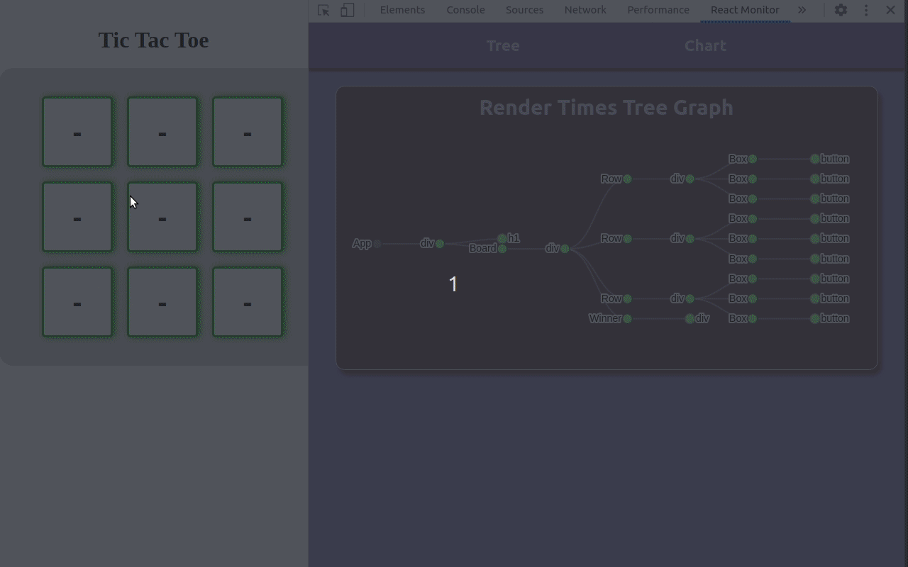

# ReactMonitor
Quickly visualize React's component tree performance for improved onboarding and debugging

## What does it do
By using the ReactMonitor Chrome DevTool, beginning and experienced developers alike are able to get a visual representation of an existing codebase that they are working on. Built with React, this tool will dynamically traverse the fiber root object behind the scenes, displaying state, props, render times and the type of components on the page.




## How to install and run
To be able to use the application, users can:
- Download the 'ReactMonitor' Google Chrome extension from [The Chrome Web Store](https://chrome.google.com/webstore/detail/reactmonitor)
- Run the NPM package in your own codebase by following these steps:
  - Install the [package](https://www.npmjs.com/package/reactmonitorfiber)\
  `npm install reactmonitorfiber`
  - Require/Import the package\
  `import reactMonitor from 'reactmonitorfiber'`\
  or\
  `const reactMonitor = require('reactmonitorfiber')`
  - Invoke React Monitor with an input of the DOM element that you are rendering the React Element into
    ```
    const container = document.querySelector('#root');
    reactDOM.render(<App />, container);
    reactMonitor(container);
    ```
- Navigate to the domain of your React application that you will be running React Monitor on
- Open your Chrome Developer Tools and select React Monitor
- You are now able to view state changes on your application in real time!

## Contributing

As an open-sourced project, ReactMonitor gladly accepts help whenever possible. If you have suggestions for improvements or run into any bugs, please feel free to open a github issue after checking whether no such issue has been filed yet. When you file a github issue, please include the following information:

#### Description
##### Steps to Reproduce
###### 1.
###### 2.
###### 3.
##### Expected behavior:
##### Actual behavior:
##### Reproduces how often:
##### Versions: x.x
##### Additional Information:

## Authors

**Rudo Hengst:** [@RudoH](https://github.com/RudoH)\
**Lia Pham:**    [@lpham598](https://github.com/lpham598)\
**Tommy Han:**   [@simple-sifu](https://github.com/simple-sifu)

## License 

This project is licensed under the MIT License - see the [LICENSE](./LICENSE) file for details


